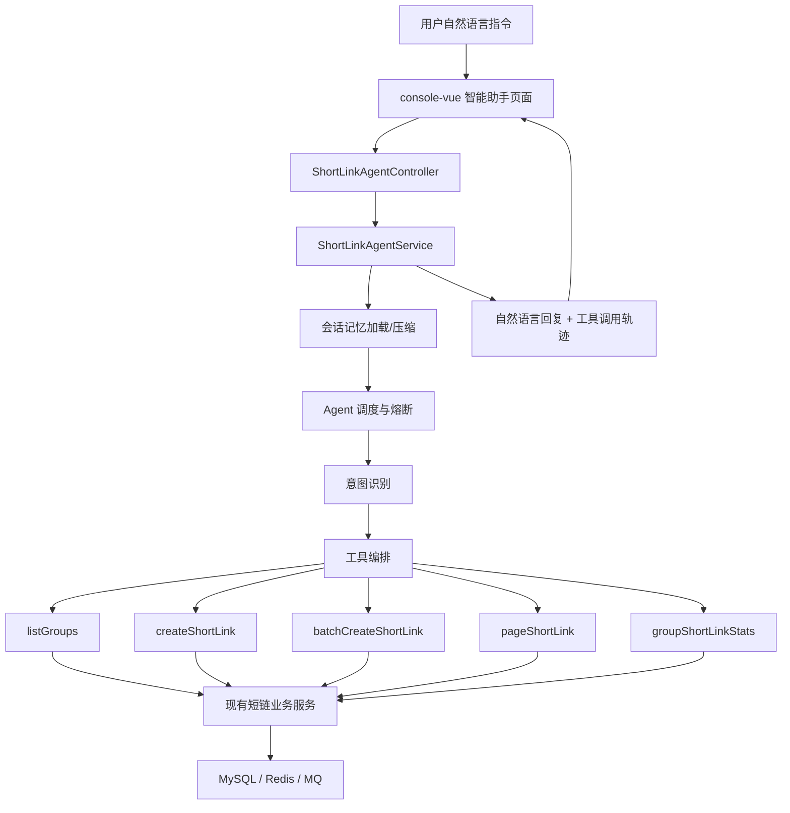

# 智能短链 Agent 改造说明

## 选题定位

本项目选择方向二：企业级应用软件的 Agent 改造。原系统是企业级短链接 SaaS 平台，已具备用户、分组、短链创建、批量创建、回收站、访问统计、Redis 缓存、消息队列和网关等基础能力。

本次改造目标是在保持 Java 技术栈的前提下，为现有短链接平台增加“智能短链运营 Agent”，让用户可以通过自然语言完成短链创建、短链查询、分组统计分析和运营建议生成。

## 改造前痛点

- 短链创建依赖表单操作，用户需要理解分组、有效期、描述等字段。
- 统计页面只展示指标，用户仍需要自行分析 PV、UV、UIP、地域、设备和浏览器分布。
- 批量创建、查询、统计分析是割裂流程，缺少面向运营目标的统一入口。
- 系统已有大量业务 API，但缺少将 API 编排为多步骤任务的智能层。

## 改造后能力

- 自然语言创建短链：识别 URL、有效期和描述，自动选择分组并调用创建工具。
- 批量短链创建：从用户输入中抽取多个 URL，调用现有批量创建能力。
- 分组与短链查询：自然语言查看分组列表、短链列表。
- 运营分析报告：调用分组统计接口，生成 PV、UV、UIP、地域、设备、浏览器和风险建议。
- 工具调用可观测：前端展示 Agent 意图、工具名称、调用结果和建议动作。
- 会话记忆压缩：保留最近多轮原文对话，较早上下文压缩为摘要，避免上下文无限增长。
- 调度熔断降级：参考 RAG 项目的模型健康状态思想，为 Agent 主策略与兜底策略增加失败计数、半开探测和自动恢复。

## Agent 架构

## 工具清单

| 工具 | 复用能力 | 作用 |
| --- | --- | --- |
| listGroups | GroupService.groupList | 获取当前用户分组 |
| createShortLink | ShortLinkService.createShortLink | 创建单个短链 |
| batchCreateShortLink | ShortLinkService.batchCreateShortLink | 批量创建短链 |
| pageShortLink | ShortLinkService.pageShortLink | 查询短链列表 |
| groupShortLinkStats | ShortLinkStatsService.groupShortLinkStats | 生成分组运营分析 |

## 智能调度增强

本次改造吸收了另一个 RAG 项目的 AI 调度思想，但没有直接引入复杂 RAG 数据库依赖，而是按短链系统场景做了轻量化落地：

- AgentRoutingExecutor：维护多个候选调度策略，主策略失败时自动切换到 safe-fallback。
- AgentCircuitBreakerStore：记录候选策略连续失败次数，达到阈值后进入 OPEN 状态，冷却后进入 HALF_OPEN 探测。
- AgentMemoryService：按 conversationId 和 userId 保存会话，超过阈值后将较早消息压缩为摘要，只保留最近多轮原文。
- Tool Trace：每个工具调用记录 request、response 摘要、success、durationMs 和错误信息，便于报告展示可观测性。

这使得智能助手不再是简单规则 if-else，而是具备可解释的 Agentic 调度闭环：记忆加载 -> 意图识别 -> 工具选择 -> 熔断保护 -> 结果总结 -> 记忆追加。

## 演示脚本

1. 打开系统首页，进入“智能助手”。
2. 输入：`查看当前分组列表`，展示 Agent 调用 listGroups。
3. 输入：`帮我给 https://www.zhihu.com 创建一个 7 天有效的短链`，展示 Agent 自动创建短链。
4. 输入：`查看当前分组短链列表`，展示 Agent 查询已有短链。
5. 输入：`分析默认分组最近 7 天访问情况`，展示 Agent 调用统计接口并输出运营建议。
6. 连续输入多轮问题，展示右侧“会话记忆”和“调度状态”如何变化。

## 后续扩展

- 接入 LangChain4j 或 Spring AI，将当前规则意图识别升级为 LLM Function Calling。
- 增加对话记忆，记录用户常用分组、常用有效期和常见活动描述。
- 增加定时分析任务，对访问突增、高频 IP 和异常地域分布做自动告警。
- 接入 OpenTelemetry 或日志 Trace，形成 Agent 行为评估数据集。
