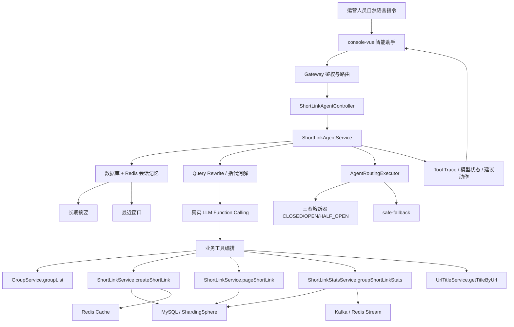

# ShortLink Agent Architecture

## 改造定位

本项目选择“方向二：企业级应用软件的 Agent 改造”。原始系统是企业级短链 SaaS 平台，已经具备用户、分组、短链创建、批量创建、回收站、访问统计、Redis 缓存、Kafka 异步统计、网关鉴权和前端管理台等能力。本次改造不是重写短链系统，而是在原系统上增加智能短链运营助手，使运营人员可以通过自然语言完成创建、查询、分析和运营建议生成。

## 总体架构

## 核心数据流

1. 用户在智能助手中输入自然语言，例如“帮我给 https://www.zhihu.com 创建一个 7 天有效的短链”。
2. Agent API 接收请求，读取 conversationId、用户信息、当前分组等上下文。
3. 记忆层从数据库加载长期摘要，并从 Redis 加载最近窗口，用于恢复多轮对话上下文。
4. Query Rewrite 模块进行术语归一化、指代消解和参数补全。
5. 真实 LLM Function Calling 根据工具 schema 选择业务工具并生成结构化参数。
6. 工具层复用原短链服务，不绕过权限校验、白名单校验、缓存预热和统计链路。
7. 工具结果被压缩为 trace，前端展示意图、工具数量、成功率、平均耗时、模型状态和建议动作。

## Agent 工具清单

| 工具 | 复用能力 | 作用 |
| --- | --- | --- |
| `listGroups` | `GroupService.groupList` | 获取当前用户短链分组 |
| `createShortLink` | `ShortLinkService.createShortLink` | 创建单个短链 |
| `batchCreateShortLink` | `ShortLinkService.batchCreateShortLink` | 批量创建短链 |
| `pageShortLink` | `ShortLinkService.pageShortLink` | 查询短链列表 |
| `groupShortLinkStats` | `ShortLinkStatsService.groupShortLinkStats` | 生成分组访问统计分析 |
| `getTitleByUrl` | `UrlTitleService.getTitleByUrl` | 获取网页标题，补全短链描述 |

## 生产级增强

- **真实 LLM Function Calling**：由模型根据工具 schema 完成意图识别、工具选择和参数抽取。
- **数据库 + Redis 记忆**：数据库保存长期摘要，Redis 缓存最近窗口，兼顾持久化和加载速度。
- **三态熔断器**：模型健康状态包括 CLOSED、OPEN、HALF_OPEN，主模型失败后自动降级到 fallback。
- **工具可观测性**：每次工具调用记录 request、responseSummary、success、durationMs 和 message。
- **原系统边界复用**：Agent 不直接写数据库，而是复用已有业务服务，保证安全性和一致性。
