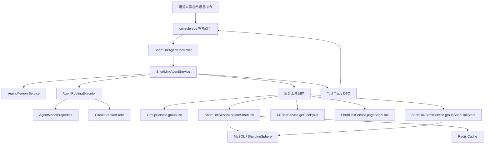

# ShortLink Agent Architecture

## 改造定位

原系统是企业级短链 SaaS 平台，具备用户、分组、短链创建、访问统计、回收站、网关、Redis 缓存、Kafka 异步统计等基础能力。本次选择“方向二：企业级应用软件的 Agent 改造”，目标是让运营人员通过自然语言完成短链运营工作，并让系统具备可观测、可配置、可降级的 Agent 调度能力。

## 改造前痛点

- 短链创建依赖表单，用户需要理解分组、有效期、描述等字段。
- 统计页面提供大量指标，但缺少面向运营决策的自动分析。
- 分组查询、短链查询、创建、统计分析是割裂流程，无法被统一编排。
- 原系统 API 能力较完整，但缺少将 API 组织成多步骤任务的智能层。
- 智能助手早期版本更像规则 demo，缺少模型配置、链路追踪和生产级降级机制。

## 改造后能力

- 自然语言创建短链，自动解析 URL、有效期、分组和描述。
- Agent 创建短链复用网页标题和 favicon 元数据链路，保证列表质量与普通表单创建一致。
- 分组列表、短链列表和分组统计均可由 Agent 调用现有业务工具完成。
- 新增模型候选配置、provider 配置、settings API 和前端模型调度面板。
- 新增工具调用耗时、成功率、意图分布、链路追踪概览等可观测能力。
- 统计保存改造为 Kafka 异步链路，提升跳转链路稳定性。

## 架构图

## 数据流

1. 用户在智能助手输入自然语言。
2. 聚合服务读取会话记忆，按模型候选配置选择调度策略。
3. Agent 识别意图并组装工具参数。
4. 工具复用现有短链业务服务，不绕过权限、分组和白名单校验。
5. 创建短链时先补齐标题元数据，再由核心服务补齐 favicon。
6. 工具调用结果被压缩为 trace 返回前端，前端渲染耗时、状态和分布图表。

## 关键工程设计

- 配置驱动模型调度：`short-link.agent.model` 定义 provider、候选模型、优先级、熔断参数和流式参数。
- 熔断降级：候选策略失败后进入 OPEN/HALF_OPEN 状态，fallback 策略兜底。
- Tool Calling 风格：每个工具都有 request、response 摘要、success、durationMs 和 message。
- 元数据一致性：Agent 创建短链与普通表单创建共用标题、favicon 链路。
- 可扩展性：后续可将规则意图识别替换为 OpenAI-compatible Function Calling 或 Spring AI。
